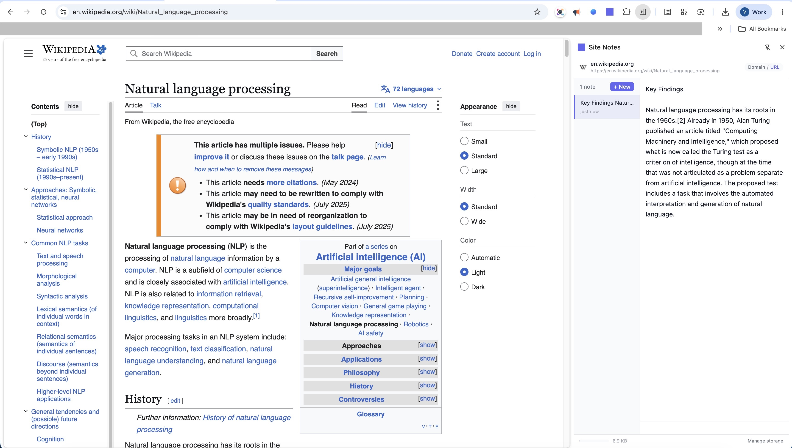
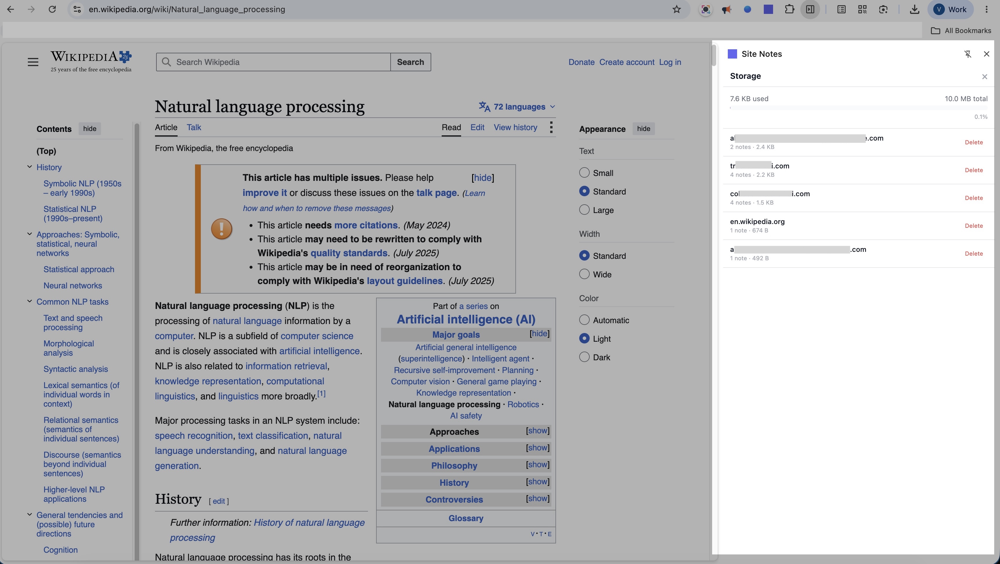

# Site Notes

A Chrome side-panel extension for taking notes on any website. Notes are stored locally in browser storage and can be scoped to the current URL or the entire domain.

## Features

- Open notes from the Chrome side panel.
- Create, edit, select, and delete multiple notes.
- Automatically associate notes with the active website.
- Switch between URL-specific and domain-wide note scopes.
- Persist notes locally with the `chrome.storage` API.
- View storage usage by domain and delete all notes for a domain.
- Receive updates when the active tab or page changes.

## Demo

### Take notes while browsing

Open Site Notes beside a webpage to create notes associated with the current URL. To view all notes saved across the website's base domain, switch the scope to **Domain**.



### Manage local storage

Review storage usage and manage saved notes by domain from the storage view.



## Requirements

- Node.js 18 or newer
- Google Chrome with side-panel support

## Development

Install dependencies:

```bash
npm install
```

Start the WXT development server:

```bash
npm run dev
```

Then load the generated extension in Chrome:

1. Open `chrome://extensions`.
2. Enable **Developer mode**.
3. Choose **Load unpacked**.
4. Select the generated `.output/chrome-mv3` directory.
5. Click the extension icon to open Site Notes in the side panel.

When source files change, rebuild or reload the unpacked extension as prompted by WXT and Chrome.

## Production Build

Build the Chrome extension:

```bash
npm run build
```

Create a distributable zip archive:

```bash
npm run zip
```

Firefox build commands are also available:

```bash
npm run dev:firefox
npm run build:firefox
npm run zip:firefox
```

## Project Structure

```text
components/             React UI components
entrypoints/background.ts  Background service worker
entrypoints/sidepanel/  Side-panel application entrypoint
hooks/                  React hooks for tabs, notes, and storage
utils/                  Storage and URL helpers
types/                  Shared TypeScript types
assets/main.css         Global styles
wxt.config.ts           WXT and extension manifest configuration
```

## Permissions

The extension requests these Chrome permissions:

- `storage` for saving notes locally
- `activeTab` and `tabs` for reading the active page and tracking tab changes
- `sidePanel` for displaying the notes interface

No server or external database is required. Notes remain in the browser profile where they were created.

## Available Scripts

| Command | Description |
| --- | --- |
| `npm run dev` | Start Chrome development mode |
| `npm run build` | Build the Chrome extension |
| `npm run zip` | Package the Chrome extension |
| `npm run dev:firefox` | Start Firefox development mode |
| `npm run build:firefox` | Build the Firefox extension |
| `npm run zip:firefox` | Package the Firefox extension |
